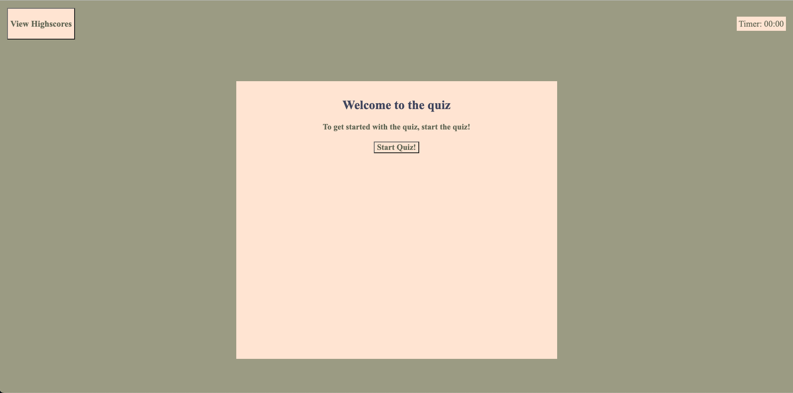

# <Quiz-Mania>

## Description

Provide a short description explaining the what, why, and how of your project.

My motivation for this project was to build a website to quiz students on their basic knowledge on programming. I built this project to help spread knowledge 
for up and coming software developers, as well as anyone who might just want to learn more about programming. Quiz mania also helps keep track of your progress
by keeping score on all quizzes.

## Table of Contents (Optional)

- [Installation](#installation)
- [Usage](#usage)
- [Credits](#credits)
- [License](#license)

## Installation

1. Direct your browser to github.com - and find What are the steps required to install your project? Provide a step-by-step description of how to get the development environment running.
    
    1. Navigate to https://github.com/jarteaga00/jose-password-generator. 
    2. In the green code button, copy the clone url for either HTTPS or SSH. 
    3. Open up your command line interface, type in "git clone " along with the url copied from github, and press enter. 
    4. Navigate to VS Code, and use the explorer icon in the top left of the screen to find the folder in which the cloned code was stored, which will open up the development enviornment. 

## Usage

Once you open up the deployed link, you will arive at the home page with the title of "Welcome to the Quiz", see screenshot in 

    1. If you are ready to start the quiz, press the Start Quiz button, which will then direct you to the first question of the quiz. Additionally, once you start the quiz, the timer in the top right corner will start ticking down, and for any questions you answer incorrectly, 5 seconds will be deducted from the timer. 

    2. Once you answer all four questions, or time expires, you will be directed to the "All done" screen where it will read you our score, and give you the option to type in your initials and record 
    what your score was. See screenshot in ./assets/images/all-done-screen.png)

    3. After you submit your score, you will be given two options - "Go Back" or "Clear High Scores". See screenshot in (./assets/images/high-scores-page.png)
    If you press "Go Back" it will direct you to the homepage where you can start your quiz again. If you press "Clear High Scores" it will clear all the scores being archived. Refreshing the page will also clear the scores.  

## Credits

## License

This project is licensed under the MIT License - see the [LICENSE.md](LICENSE.md) file for details

---